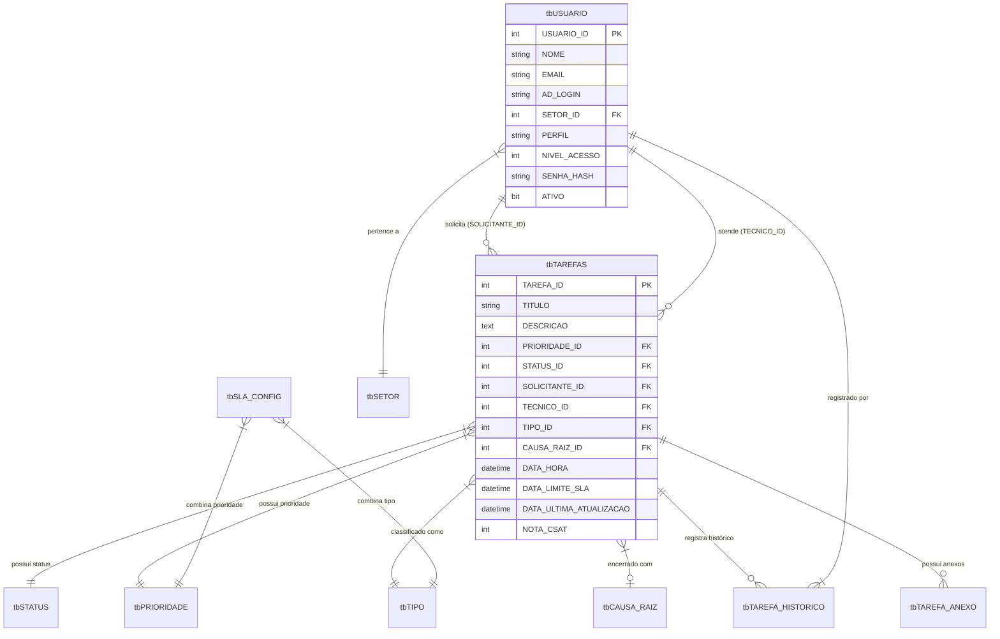

# 📑 Documentação Técnica da Solução: Saavedra Chamados (ITIL v4)

> **Tipo de Documento:** Especificação Técnica de Arquitetura & Guia do Sistema  
> **Sistema:** Saavedra Chamados — Gestão de Atendimento & Helpdesk ITIL  
> **Ambiente:** Produção / On-Premise  
> **Status:** 🟢 Ativo / Em Produção  
> **Versão da Documentação:** 1.0  
> **Autor Principal:** Jonatan Severo ([suporte.saav@saavedra.com.br](mailto:suporte.saav@saavedra.com.br))  

---

## 📌 1. Visão Geral da Solução

O **Saavedra Chamados** é uma plataforma corporativa desenvolvida para a centralização, padronização e automação dos processos de suporte técnico de TI da empresa Saavedra, fundamentada no framework **ITIL v4** (*Information Technology Infrastructure Library*).

A solução engloba todo o ciclo de vida dos incidentes e solicitações de serviço: desde o registro inicial pelo usuário solicitante, triagem e atribuição técnica, acompanhamento de histórico em tempo real, até o encerramento com registro obrigatorio de causa raiz e avaliação de satisfação (CSAT).

---

## 🏗️ 2. Ficha Técnica da Arquitetura

| Camada | Tecnologia / Componente | Versão | Função na Solução |
| :--- | :--- | :--- | :--- |
| **Backend API** | Python / FastAPI | 3.10+ / 0.100+ | Servidor de aplicação RESTful, regras de negócio e autenticação |
| **Servidor Web / ASGI** | Uvicorn / Starlette | 0.20+ | Servidor de alta performance para execução concorrente da API |
| **Banco de Dados** | Microsoft SQL Server | 2019+ | Armazenamento relacional e integridade referencial dos dados |
| **Conectividade DB** | SQLAlchemy + PyODBC | 2.0+ | Camada de persistência e execução de consultas parametrizadas |
| **Segurança & Hash** | Bcrypt / SessionMiddleware | 4.0+ | Criptografia de senhas (60 chars) e gestão de cookies de sessão |
| **Frontend Web** | HTML5, CSS3, Vanilla JS | ES6+ | Interface SPA responsiva, sem dependências de frameworks pesados |
| **Design System** | Variáveis CSS3 + Material Symbols | Standard | Componentização corporativa com suporte a perfil de acesso |
| **Notificações** | SMTP (Office 365 / Local) | TLS 587 | Disparo em background de e-mails de ticket, atribuição e CSAT |

---

## 🔄 3. Diagrama da Arquitetura do Sistema

```text
                               ┌─────────────────────────────────────────┐
                               │           REDE CORPORATIVA              │
                               └─────────────────────────────────────────┘
                                                    │
             ┌──────────────────────────────────────┼──────────────────────────────────────┐
             │                                      │                                      │
             ▼                                      ▼                                      ▼
  ┌──────────────────────┐               ┌──────────────────────┐               ┌──────────────────────┐
  │  Visão Solicitante   │               │ Visão Técnica / Fila │               │ Painel Admin & BI    │
  │ (Abertura/Acompanh.) │               │ (Triagem/Atendimento)│               │ (Métricas/Gestão)    │
  └──────────┬───────────┘               └──────────┬───────────┘               └──────────┬───────────┘
             │                                      │                                      │
             └──────────────────────────────────────┼──────────────────────────────────────┘
                                                    │ Requisições HTTP / REST (JSON)
                                                    ▼
                                     ┌─────────────────────────────┐
                                     │     FastAPI Backend (API)   │
                                     │  - Auth & Session Control   │
                                     │  - Business Logic & SLA     │
                                     │  - Scheduler ITIL (Cron)    │
                                     └──────────────┬──────────────┘
                                                    │
                        ┌───────────────────────────┴───────────────────────────┐
                        │ PyODBC                                                │ BackgroundTasks (SMTP)
                        ▼                                                       ▼
        ┌───────────────────────────────┐                       ┌───────────────────────────────┐
        │  Microsoft SQL Server (DB)    │                       │     Servidor SMTP E-mail     │
        │ - tbTAREFAS   - tbUSUARIO     │                       │ (Abertura, Movimentação, CSAT)│
        │ - tbHISTORICO - tbSLA_CONFIG  │                       └───────────────────────────────┘
        └───────────────────────────────┘
```

---

## 🗄️ 4. Dicionário do Banco de Dados (SQL Server)

O banco de dados relacional **`GestaoChamados`** foi estruturado com integridade de chaves estrangeiras para garantir rastreabilidade auditável.

### 4.1 Diagrama Entidade-Relacionamento (ER)



### 4.2 Detalhamento das Tabelas

#### **Tabela: `tbTAREFAS` (Central de Chamados)**
| Coluna | Tipo | Chave | Descrição |
| :--- | :--- | :--- | :--- |
| `TAREFA_ID` | `INT` | PK, Identity | Identificador único do ticket |
| `TITULO` | `VARCHAR(200)` | - | Título resumido do chamado |
| `DESCRICAO` | `TEXT` | - | Detalhamento técnico/solicitação inicial |
| `SOLICITANTE_ID` | `INT` | FK -> `tbUSUARIO` | Usuário que abriu o chamado |
| `TECNICO_ID` | `INT` | FK -> `tbUSUARIO` | Técnico responsável (`NULL` = Fila de Triagem) |
| `STATUS_ID` | `INT` | FK -> `tbSTATUS` | Estado atual (Novo, Em Atendimento, Concluído, etc.) |
| `PRIORIDADE_ID` | `INT` | FK -> `tbPRIORIDADE` | Nível de urgência (1=Crítica, 2=Alta, 3=Média, 4=Baixa) |
| `TIPO_ID` | `INT` | FK -> `tbTIPO` | Classificação do serviço (Incidente, Solicitação, etc.) |
| `CAUSA_RAIZ_ID` | `INT` | FK -> `tbCAUSA_RAIZ` | Motivo raiz selecionado no encerramento |
| `DATA_HORA` | `DATETIME` | - | Carimbo de data/hora de abertura |
| `DATA_LIMITE_SLA` | `DATETIME` | - | Data/hora limite de vencimento calculada pela matriz SLA |
| `DATA_ULTIMA_ATUALIZACAO`| `DATETIME` | - | Data/hora da última resposta ou movimentação |
| `NOTA_CSAT` | `INT` | - | Nota de satisfação atribuída pelo solicitante (1 a 5) |

#### **Tabela: `tbUSUARIO` (Contas e Permissões)**
| Coluna | Tipo | Chave | Descrição |
| :--- | :--- | :--- | :--- |
| `USUARIO_ID` | `INT` | PK, Identity | Identificador único do usuário |
| `NOME` | `VARCHAR(150)` | - | Nome completo do colaborador |
| `EMAIL` | `VARCHAR(150)` | - | Endereço corporativo de e-mail |
| `AD_LOGIN` | `VARCHAR(100)` | - | Nome de usuário no Active Directory / Rede |
| `SETOR_ID` | `INT` | FK -> `tbSETOR` | Setor corporativo a que pertence |
| `PERFIL` | `VARCHAR(50)` | - | Perfil de acesso: `Admin`, `Gestor`, `Tecnico`, `Comum` |
| `SENHA_HASH` | `VARCHAR(255)` | - | Hash de senha criptografada em Bcrypt |
| `ATIVO` | `BIT` | - | Status da conta (1 = Ativo / 0 = Inativo) |

#### **Tabela: `tbTAREFA_HISTORICO` (Linha do Tempo & Apontamentos)**
| Coluna | Tipo | Chave | Descrição |
| :--- | :--- | :--- | :--- |
| `HISTORICO_ID` | `INT` | PK, Identity | Identificador único do registro de histórico |
| `TAREFA_ID` | `INT` | FK -> `tbTAREFAS` | Ticket associado |
| `USUARIO_ID` | `INT` | FK -> `tbUSUARIO` | Usuário que fez a interação/comentário |
| `STATUS_ID_NA_OCASIAO` | `INT` | FK -> `tbSTATUS` | Status do ticket no momento do registro |
| `COMENTARIO` | `TEXT` | - | Conteúdo do apontamento |
| `NOTA_INTERNA` | `BIT` | - | `1` = Apontamento privado da equipe / `0` = Público |

#### **Tabela: `tbSLA_CONFIG` (Matriz de SLA)**
| Coluna | Tipo | Chave | Descrição |
| :--- | :--- | :--- | :--- |
| `SLA_ID` | `INT` | PK, Identity | Identificador da regra de SLA |
| `PRIORIDADE_ID` | `INT` | FK -> `tbPRIORIDADE` | ID da prioridade combinada |
| `TIPO_ID` | `INT` | FK -> `tbTIPO` | ID do tipo de chamado combinado |
| `TEMPO_HORAS` | `INT` | - | Horas permitidas para conclusão daquele tipo/prioridade |

---

## 🔌 5. Catálogo de Endpoints REST da API

| Método | Rota API | Finalidade | Nível de Permissão |
| :--- | :--- | :--- | :--- |
| `POST` | `/api/auth/login` | Autentica usuário e estabelece sessão | Público |
| `GET` | `/api/auth/me` | Retorna dados da sessão ativa | Logado |
| `GET` | `/api/auth/logout` | Destrói a sessão ativa | Logado |
| `POST` | `/api/auth/alterar-senha` | Atualiza a senha do usuário autenticado | Logado |
| `GET` | `/api/kpis` | Retorna contadores dinâmicos de SLA e status | Logado |
| `GET` | `/api/tarefas` | Retorna fila de chamados com paginação e filtros | Admin / Gestor / Técnico |
| `GET` | `/api/meus-chamados` | Retorna chamados abertos pelo próprio solicitante | Solicitante |
| `GET` | `/api/tarefas/{id}` | Traz detalhes, histórico público e anexos do ticket | Logado (Autorizado) |
| `POST` | `/api/tarefas` | Cria um novo chamado no sistema | Logado |
| `PUT` | `/api/tarefas/{id}` | Atualiza status, técnico, tipo e causa raiz | Admin / Gestor / Técnico |
| `POST` | `/api/tarefas/{id}/responder` | Insere novo comentário no histórico do ticket | Logado |
| `POST` | `/api/tarefas/{id}/anexar` | Envia e vincula ficheiros/anexos ao ticket | Logado |
| `POST` | `/api/tarefas/{id}/avaliar` | Registra nota CSAT (1 a 5 estrelas) | Solicitante |
| `GET` | `/api/usuarios` | Lista usuários corporativos cadastrados | Admin / Gestor |
| `GET` | `/api/admin/sla-matrix` | Traz a matriz configurada de SLAs | Admin |
| `POST` | `/api/admin/reenviar-csat-pendentes` | Dispara e-mails de lembrete CSAT pendentes | Admin |

---

## 🤖 6. Rotinas de Automação em Background (Cron ITIL)

O sistema possui workers assíncronos configurados diretamente no ciclo de vida da aplicação (`api/main.py`):

1. **Encerramento Automático por Inatividade (SLA ITIL):**
   - **Frequência:** Execução a cada 12 horas.
   - **Regra:** Procura chamados com status *Aguardando Solicitante* ou *Validação* cuja última atualização tenha ocorrido há mais de **3 dias (72 horas)**.
   - **Ação:** Altera o status para `Concluído` (ID 4), associa a causa raiz `"Encerramento Automático (Inatividade ITIL)"` e insere registro de histórico de sistema.

2. **Rotativa de Expurgos de Log:**
   - Logs de auditoria gerados em `logs/sistema_geral.log` com mais de **7 dias** são automaticamente deletados do disco para evitar esgotamento de storage.

---

## ⚙️ 7. Guia de Implantação e Variáveis de Ambiente

### 7.1 Arquivo de Configuração `.env`

O backend lê as configurações corporativas a partir do arquivo `.env` localizado na pasta `api/`:

```ini
# Configurações do Banco de Dados SQL Server
SAAVEDRA_DB_USER=chamados
SAAVEDRA_DB_PASS=SuaSenhaSegura123
SAAVEDRA_DB_HOST=10.0.0.252
SAAVEDRA_DB_NAME=GestaoChamados

# Chave de Criptografia da Sessão Web
SAAVEDRA_SECRET_KEY=sua_chave_secreta_super_segura_aqui!

# Configurações de E-mail (SMTP)
SAAVEDRA_SMTP_HOST=smtp.office365.com
SAAVEDRA_SMTP_PORT=587
SAAVEDRA_SMTP_USER=suporte.saav@saavedra.com.br
SAAVEDRA_SMTP_PASS=SuaSenhaSMTP
SAAVEDRA_SMTP_FROM=suporte.saav@saavedra.com.br
```

### 7.2 Comandos para Inicialização no Servidor Windows

```powershell
# 1. Navegar até o diretório do projeto
cd M:\GestaoChamados\api

# 2. Ativar o ambiente virtual Python
.\venv\Scripts\activate

# 3. Iniciar o servidor de aplicação Uvicorn
uvicorn main:app --host 0.0.0.0 --port 8082 --workers 4
```

---

## 👨‍💻 8. Informações de Autoria & Suporte Técnico

Para dúvidas arquiteturais, solicitações de alterações ou suporte técnico nesta solução:

* **Desenvolvedor Principal:** Jonatan Severo
* 📧 **E-mail de Suporte:** [suporte.saav@saavedra.com.br](mailto:suporte.saav@saavedra.com.br)
* 💼 **Perfil profissional LinkedIn:** [linkedin.com/in/jonatanfsevero](https://www.linkedin.com/in/jonatanfsevero/)
* 🏢 **Unidade de Negócio:** Saavedra Suporte Web

---
*Documentação gerada e mantida na Wiki da Saavedra no Confluence.*
