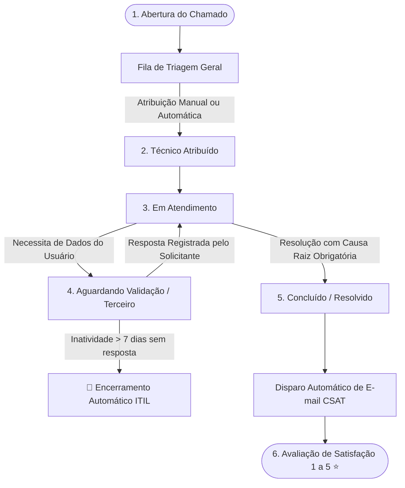

# 🎧 Saavedra Chamados — Sistema de Gestão de Serviços & Helpdesk ITIL

[](https://www.python.org/)
[](https://fastapi.tiangolo.com/)
[](https://www.microsoft.com/sql-server)
[](LICENSE)
[]()

> **Saavedra Chamados** é uma plataforma corporativa completa para gestão de serviços de TI e Helpdesk alinhada às melhores práticas **ITIL v4**. O sistema engloba controle de SLA, cálculo matricial de prioridades, pesquisa de satisfação (CSAT), dashboard interativo de BI e automação de rotinas de suporte técnico.

---

## 📌 Sumário

- [Visão Geral](#-visão-geral)
- [Ciclo de Vida do Chamado (Fluxo ITIL)](#-ciclo-de-vida-do-chamado-fluxo-itil)
- [Funcionalidades Principais](#-funcionalidades-principais)
- [Telas do Sistema](#-telas-do-sistema)
- [Arquitetura e Tecnologias](#-arquitetura-e-tecnologias)
- [Estrutura do Repositório](#-estrutura-do-repositório)
- [Pré-requisitos e Instalação](#-pré-requisitos-e-instalação)
- [Configuração de Variáveis de Ambiente (`.env`)](#-configuração-de-variáveis-de-ambiente-env)
- [Endpoints da API REST](#-endpoints-da-api-rest)
- [Automações & Cron Jobs ITIL](#-automações--cron-jobs-itil)
- [Documentação Adicional](#-documentação-adicional)
- [Desenvolvedor & Licença](#-desenvolvedor--licença)

---

## 🌐 Visão Geral

O **Saavedra Chamados** foi desenvolvido para centralizar, organizar e automatizar as operações de suporte de TI. Oferece interfaces distintas e adaptativas conforme o perfil do usuário (**Administrador, Gestor, Técnico e Solicitante/Comum**), garantindo segurança, controle rigoroso de prazos e métricas analíticas em tempo real.

```text
┌─────────────────┐       ┌─────────────────┐       ┌────────────────────────┐
│  Frontend Web   │ ◄───► │  Backend REST   │ ◄───► │ Banco SQL Server 2016  │
│ HTML5/CSS3/JS   │ HTTP  │ FastAPI/Uvicorn │ PyODBC│  - tbTAREFAS           │
└─────────────────┘       └─────────────────┘       │  - tbUSUARIO           │
                                   │                │  - tbSLA_CONFIG        │
                                   ▼                └────────────────────────┘
                            ┌───────────────┐
                            │ Servidor SMTP │
                            │ (Notificações)│
                            └───────────────┘
```

---

## 🔄 Ciclo de Vida do Chamado (Fluxo ITIL)

O ciclo de vida das solicitações segue um fluxo controlado de governança, garantindo rastreabilidade desde a abertura até a avaliação pós-atendimento:



---

## ✨ Funcionalidades Principais

### 🎫 Gestão do Ciclo de Vida do Chamado (ITIL)
- **Abertura e Triagem:** Formulário intuitivo de abertura com suporte a múltiplos anexos e recurso **Copy & Paste** dinâmico (com visualização de miniaturas).
- **Editor Rico (WYSIWYG):** Descrições e Work Notes contam com formatação avançada (Quill.js) para inserção estruturada de textos, listas e blocos de código.
- **Visualização Flexível:** Alternância dinâmica entre visualização em **Tabela** e quadro **Kanban**.
- **Histórico & Notas Internas:** Linha do tempo detalhada das movimentações do ticket, permitindo comentários públicos ou **notas internas restritas** à equipe técnica.
- **Fechamento Obrigatório:** Validação de **Causa Raiz** para encerramento ou cancelamento de tickets.

### ⏱️ Gestão Inteligente de SLA (Service Level Agreement)
- Matriz dinâmica de tempo de atendimento baseada em **Prioridade x Tipo de Incidente/Solicitação**.
- Indicadores visuais de status do SLA: **No prazo**, **Em Atenção (prazo crítico < 2h)** e **Estourado (Vencido)**.
- Recálculo de prazos conforme alterações de classificação pelo técnico ou forçado em lote pelo administrador.

### ⭐ Pesquisa de Satisfação (CSAT - Customer Satisfaction)
- Avaliação de atendimento pós-encerramento (escala de 1 a 5 estrelas).
- Envio automático de e-mail interativo contendo links diretos para avaliação com 1 clique.
- Disparo em massa de lembretes para aumentar o engajamento dos solicitantes.

### 📊 Painel BI & Relatórios Gerenciais
- Dashboard analítico interativo (`bi.html`) com **suporte a cross-filtering**, drill-through para dados brutos e filtros temporais.
- Indicadores de Volume de Chamados por Setor, Ranking de Solicitantes, Distribuição de Causas Raiz e Nota Média de CSAT.
- Exportação de relatórios para **Excel / CSV** e exportação executiva em **PDF**.

### 🔐 Segurança & Auditoria Avançada
- **Autenticação de Sessão:** Controle via cookie de sessão seguro (`SessionMiddleware`).
- **Criptografia de Senhas:** Armazenamento seguro de credenciais utilizando algoritmo **Bcrypt** nativo.
- **Sistema de Auditoria & Logs:** Log rotativo de requisições HTTP, exceções e auditoria de ações críticas armazenado em `logs/sistema_geral.log` com retenção automática de 7 dias.

---

## 🖥️ Telas do Sistema

| Visão Geral da Fila de Chamados | Painel Executivo de BI |
| :---: | :---: |
|  |  |
| *Fila principal com badges de SLA e filtros rápidos* | *Cross-filtering dinâmico por setor, técnico e status* |

| Detalhes do Chamado & Histórico | Modo Kanban Interativo |
| :---: | :---: |
|  |  |
| *Timeline com notas internas e upload de evidências* | *Distribuição visual dos tickets por status operacional* |

> 💡 *Dica:* Para visualizar os prints em tamanho real ou atualizar as imagens, consulte o diretório [`docs/img/`](docs/img/).

---

## 🛠️ Arquitetura e Tecnologias

### **Backend**
- **Linguagem:** Python 3.10+
- **Framework Web:** [FastAPI](https://fastapi.tiangolo.com/) com servidor ASGI [Uvicorn](https://www.uvicorn.org/) (Arquitetura modular baseada em `APIRouter`)
- **OR/Query Layer:** [SQLAlchemy](https://www.sqlalchemy.org/) com driver [PyODBC](https://github.com/mkleehammer/pyodbc)
- **Segurança:** `bcrypt` para hash de credenciais e `Starlette SessionMiddleware`
- **Validação de Dados:** `Pydantic v2`

### **Frontend**
- **Core:** Vanilla JavaScript (ES6+), HTML5 Semântico
- **Estilização:** CSS3 puro com Design System proprietário (variáveis CSS, layouts flex/grid e suporte a modo responsivo)
- **Editores e Gráficos:** [Quill.js](https://quilljs.com/) (Editor WYSIWYG) e [Chart.js](https://www.chartjs.org/) (Gráficos Interativos)
- **Ícones:** [Google Material Symbols](https://fonts.google.com/icons)

### **Banco de Dados**
- **Engine:** **Microsoft SQL Server 2016 Standard Edition**
- 📄 Documentação completa do modelo de dados e diagrama ER: **[`docs/database.md`](docs/database.md)**

---

## 📂 Estrutura do Repositório

```text
.
├── api/                      # Backend em Python FastAPI
│   ├── main.py               # Ponto de entrada (Uvicorn), middlewares e scheduler ITIL
│   ├── config.py             # Carregador de variáveis de ambiente e parâmetros de infra
│   ├── database.py           # Conexão e pooling SQLAlchemy com SQL Server
│   ├── schemas.py            # Modelos de validação Pydantic
│   ├── utils.py              # Utilitários de e-mail (SMTP), formatação e logs
│   ├── routers/              # Controladores isolados por domínio (APIRouter)
│   │   ├── admin.py          # Lógica administrativa (SLAs, recálculo e CSAT)
│   │   ├── auth.py           # Autenticação de usuários e gestão de sessão
│   │   ├── cadastros.py      # Gestão de usuários, setores e tabelas auxiliares
│   │   ├── relatorios.py     # Endpoints de KPIs e métricas do BI
│   │   └── tarefas.py        # Fila principal de chamados, anexos e ações
│   ├── migrasenha.py         # Script utilitário para migração segura de senhas para Bcrypt
│   ├── reenviar_csat.py      # Disparador automatizado de pesquisas de satisfação
│   └── testar_email.py       # Validador de credenciais e envio SMTP
├── frontend/                 # Interface Web da Aplicação
│   ├── js/                   # Módulos JavaScript utilitários
│   │   └── anexos.js         # Módulo avançado de múltiplos anexos e Copy & Paste
│   ├── auth.js               # Gerenciador global de sessão e permissões de tela
│   ├── style.css             # Design System moderno, variáveis e temas
│   ├── index.html            # Dashboard principal, Kanban e Fila de Chamados
│   ├── admin.html            # Painel Administrativo (Usuários, SLAs e Domínios)
│   ├── bi.html               # Painel de Business Intelligence / Analytics
│   ├── detalhe_chamado.html  # Visualização de ticket, inclusão de anexos e histórico
│   ├── login.html            # Tela de autenticação corporativa
│   ├── novo_chamado.html     # Formulário de abertura de chamados com WYSIWYG
│   ├── relatorios.html       # Painel de Relatórios Gerenciais (Admin/Gestor)
│   └── relatorios_comum.html # Painel de Acompanhamento Pessoal (Solicitante)
├── docs/                     # Documentações Técnicas e Arquiteturais
│   ├── database.md           # Diagrama ER detalhado e Dicionário de Dados SQL Server
│   ├── img/                  # Capturas de tela e evidências visuais
│   └── learning/             # Cronogramas e materiais de capacitação técnica
├── DOCUMENTACAO_CONFLUENCE.md# Manual detalhado para publicação na base de conhecimento
├── LICENSE                   # Licença de uso do software (MIT)
└── README.md                 # Visão geral do projeto (este arquivo)
```

---

## 🚀 Pré-requisitos e Instalação

### **1. Requisitos do Sistema**
- **Python 3.10** ou superior instalado.
- **Microsoft SQL Server 2016** (ou superior) acessível na rede.
- **Driver ODBC para SQL Server** (*Microsoft ODBC Driver 17 or 18 for SQL Server* ou driver legado *SQL Server*).

### **2. Configuração do Backend**

Clone o repositório e navegue até a pasta da API:
```bash
git clone https://github.com/suportesaav-web/saavedra_chamados.git
cd saavedra_chamados/api
```

Crie e ative um ambiente virtual Python:
```bash
# Windows (PowerShell)
python -m venv venv
.\venv\Scripts\activate

# Linux/macOS
python3 -m venv venv
source venv/bin/activate
```

Instale as dependências exigidas:
```bash
pip install fastapi uvicorn sqlalchemy pyodbc bcrypt python-dotenv pydantic
```

---

## 🔑 Configuração de Variáveis de Ambiente (`.env`)

Crie um arquivo `.env` dentro do diretório `api/` com a seguinte estrutura de configuração:

```ini
# Configurações do Banco de Dados SQL Server
SAAVEDRA_DB_USER=chamados
SAAVEDRA_DB_PASS=SuaSenhaSegura123
SAAVEDRA_DB_HOST=10.0.0.252
SAAVEDRA_DB_NAME=GestaoChamados

# Chave de Criptografia da Sessão Web (Starlette)
SAAVEDRA_SECRET_KEY=sua_chave_secreta_super_segura_aqui!

# Configurações de Notificações de E-mail (SMTP)
SAAVEDRA_SMTP_HOST=smtp.office365.com
SAAVEDRA_SMTP_PORT=587
SAAVEDRA_SMTP_USER=suporte.saav@saavedra.com.br
SAAVEDRA_SMTP_PASS=SuaSenhaSMTP
SAAVEDRA_SMTP_FROM=suporte.saav@saavedra.com.br

# URL Base da Aplicação Web
SAAVEDRA_FRONTEND_URL=http://10.0.0.252:8082
```

---

## 🏃 Executando a Aplicação

### **Iniciando a API Backend**
Dentro do diretório `api/` (com o ambiente virtual ativo):
```bash
uvicorn main:app --host 0.0.0.0 --port 8000 --reload
```

A documentação interativa Swagger da API estará disponível em:
👉 **`http://localhost:8000/docs`**

### **Acessando o Frontend**
Abra o arquivo `frontend/index.html` em seu navegador ou utilize um servidor web estático (ex: Nginx, IIS ou extensão *Live Server* no VS Code).

---

## 🔌 Endpoints da API REST

| Método | Rota | Descrição | Acesso |
| :--- | :--- | :--- | :--- |
| `POST` | `/api/auth/login` | Realiza autenticação e inicia sessão web | Público |
| `GET` | `/api/auth/me` | Retorna dados do usuário autenticado | Autenticado |
| `GET` | `/api/auth/logout` | Encerra a sessão ativa do usuário | Autenticado |
| `POST` | `/api/auth/alterar-senha` | Altera a senha do usuário logado | Autenticado |
| `GET` | `/api/kpis` | Retorna métricas e contadores dinâmicos de SLA/Status | Autenticado |
| `GET` | `/api/tarefas` | Lista chamados da fila com filtros e paginação | Admin / Gestor / Técnico |
| `GET` | `/api/meus-chamados` | Lista os chamados abertos pelo solicitante logado | Solicitante |
| `GET` | `/api/tarefas/{id}` | Retorna detalhes completos e anexos do chamado | Autenticado |
| `POST` | `/api/tarefas` | Registra um novo chamado na plataforma | Autenticado |
| `PUT` | `/api/tarefas/{id}` | Atualiza status, técnico, tipo ou causa raiz do chamado | Admin / Gestor / Técnico |
| `POST` | `/api/tarefas/{id}/responder` | Adiciona comentário/resposta ao histórico do chamado | Autenticado |
| `POST` | `/api/tarefas/{id}/anexar` | Envia e vincula ficheiros/anexos ao chamado | Autenticado |
| `POST` | `/api/tarefas/{id}/avaliar` | Registra nota CSAT (1 a 5 estrelas) no chamado | Solicitante |
| `GET` | `/api/usuarios` | Lista todos os usuários cadastrados | Admin / Gestor |
| `GET` | `/api/admin/sla-matrix` | Retorna a matriz configurável de SLAs | Admin |
| `POST` | `/api/admin/recalcular-sla` | Força recálculo dos SLAs de tickets em aberto | Admin |
| `POST` | `/api/admin/reenviar-csat-pendentes`| Dispara e-mails de lembrete CSAT pendentes em lote | Admin |

---

## 🤖 Automações & Cron Jobs ITIL

O backend conta com rotinas automáticas de background:

1. **Encerramento Automático por Inatividade (ITIL):**
   Chamados que estejam com status de *Aguardando Solicitante* ou *Validação* há mais de **7 dias** sem qualquer interação são automaticamente encerrados pela rotina ITIL em background, atribuindo a causa raiz `"Encerramento Automático (Inatividade ITIL)"` e registrando o histórico no ticket.

2. **Limpeza e Rotação de Logs de Auditoria:**
   Logs de auditoria gerados em `logs/sistema_geral.log` com mais de 7 dias de criação são expurgados periodicamente para preservação de integridade e espaço em disco.

---

## 📖 Documentação Adicional

- 🗄️ **[Modelagem e Arquitetura do Banco de Dados](docs/database.md)**: Diagrama ER completo, campos, chaves e dicionário de dados.
- 📘 **[Manual de Publicação e Operação (Confluence)](DOCUMENTACAO_CONFLUENCE.md)**: Guia completo para equipes de suporte e implantação corporativa.
- 🎓 **[Roteiros de Capacitação Técnica](docs/learning/cronograma.md)**: Trilhas de estudos e materiais complementares de automação DevOps.

---

## 👨‍💻 Desenvolvedor & Autoria

Projetado e desenvolvido por **Jonatan Severo**.

- 📧 **E-mail:** [suporte.saav@saavedra.com.br](mailto:suporte.saav@saavedra.com.br)
- 💼 **LinkedIn:** [linkedin.com/in/jonatanfsevero](https://www.linkedin.com/in/jonatanfsevero/)
- 🏢 **Organização:** Saavedra Suporte Web

---

## 📄 Licença

Este projeto está licenciado sob os termos da licença **MIT**. Para mais detalhes, consulte o arquivo [`LICENSE`](LICENSE).

---

<p align="center">
  Desenvolvido com 🧡 por <strong>Jonatan Severo</strong> — Saavedra Suporte Web
</p>
