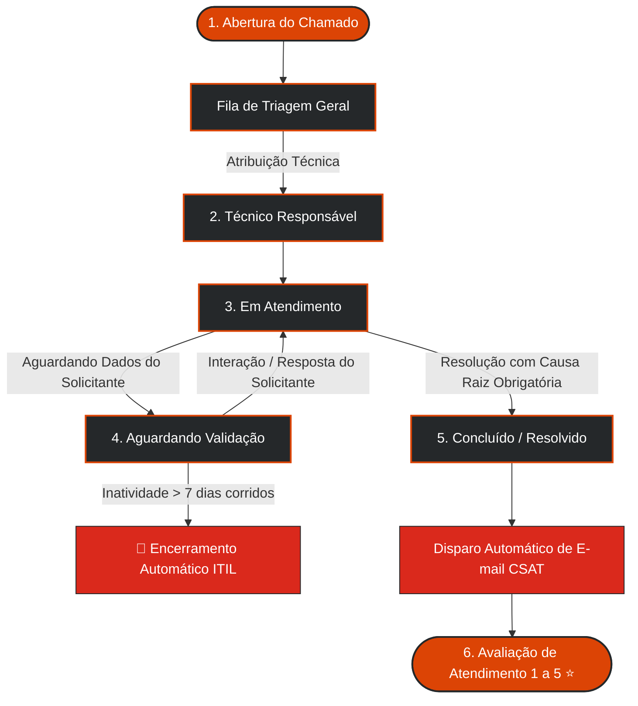
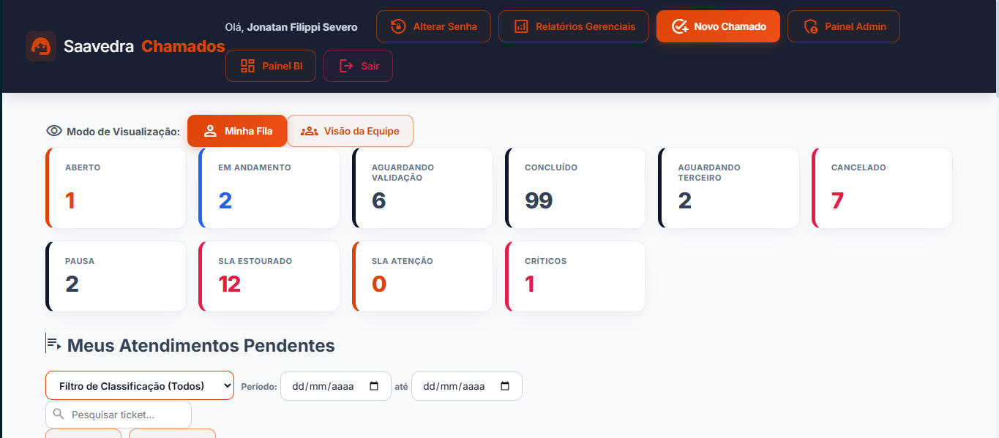
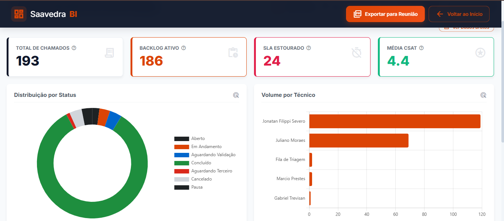
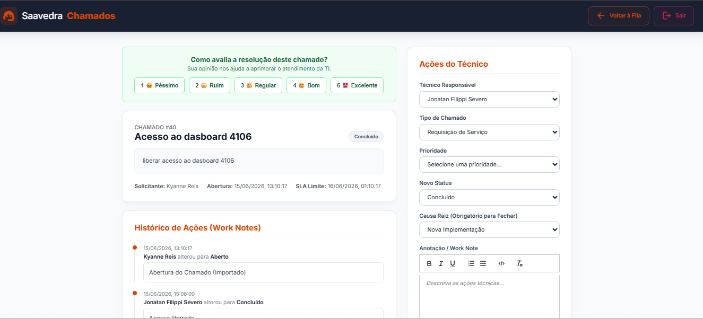
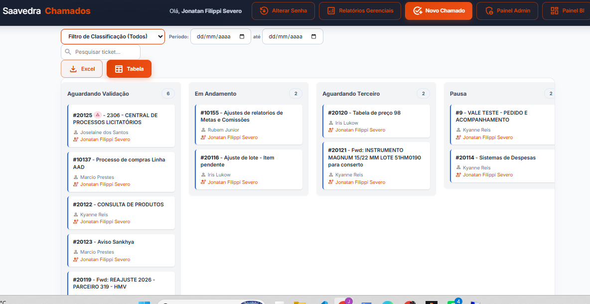

<div align="center">

# <span style="color: #25282a;">Saavedra</span> <span style="color: #dc4405;">Chamados</span>

### 🎧 Sistema Corporativo de Gestão de Serviços de TI & Helpdesk ITIL v4

<p align="center">
  
  
  
  
  
</p>

<p align="center">
  <a href="#-visão-geral"><b>Visão Geral</b></a> &bull;
  <a href="#-ciclo-de-vida-do-chamado-itil"><b>Fluxo ITIL</b></a> &bull;
  <a href="#-recursos-e-funcionalidades"><b>Funcionalidades</b></a> &bull;
  <a href="#-telas-da-plataforma"><b>Telas</b></a> &bull;
  <a href="#-arquitetura-e-tecnologias"><b>Tecnologias</b></a> &bull;
  <a href="#-instalação-e-execução"><b>Instalação</b></a> &bull;
  <a href="#-endpoints-da-api"><b>Endpoints</b></a>
</p>

---

</div>

## 🌐 Visão Geral

O **Saavedra Chamados** é uma plataforma corporativa robusta desenvolvida para unificar, padronizar e monitorar os processos de suporte e atendimento de Tecnologia da Informação. 

Projetada especificamente para as operações da **Saavedra**, a ferramenta oferece interfaces especializadas por perfil de acesso (**Administrador**, **Gestor**, **Técnico** e **Solicitante**), garantindo conformidade com as diretrizes da biblioteca **ITIL v4**, controle matricial de prazos (SLA), histórico auditável e métricas em tempo real.

```text
┌─────────────────────────┐          ┌─────────────────────────┐          ┌───────────────────────────────┐
│      Frontend Web       │  HTTP    │      Backend REST       │  PyODBC  │   Banco SQL Server 2016       │
│  HTML5 / CSS3 / Vanilla │ ◄──────► │  FastAPI / Uvicorn ASGI │ ◄──────► │   - tbTAREFAS                 │
│  Editor Quill / ChartJS │          │  Auditoria & Scheduler  │          │   - tbUSUARIO                 │
└─────────────────────────┘          └────────────┬────────────┘          │   - tbSLA_CONFIG / tbHISTORICO│
                                                  │                       └───────────────────────────────┘
                                                  ▼
                                     ┌─────────────────────────┐
                                     │  Servidor SMTP Saavedra │
                                     │  Disparos & Pesquisa    │
                                     └─────────────────────────┘
```

---

## 🔄 Ciclo de Vida do Chamado (ITIL)

O fluxo de atendimento é automatizado e auditável, garantindo que nenhum chamado fique estagnado sem governança:



---

## ✨ Recursos e Funcionalidades

<table>
  <tr>
    <td width="50%" valign="top">
      <h3 style="color: #dc4405; margin-top: 0;">🎫 Gestão Operacional de Chamados</h3>
      <ul>
        <li><b>Abertura Simplificada:</b> Formulário intuitivo com suporte nativo a múltiplos anexos e <b>Copy & Paste de imagens (Ctrl+V)</b> direto da área de transferência.</li>
        <li><b>Editor Rico (WYSIWYG):</b> Formatação completa de texto com listas, blocos de código e destaques via Quill.js.</li>
        <li><b>Linha do Tempo & Work Notes:</b> Histórico cronológico detalhado com separação entre comentários públicos e <b>notas internas confidenciais</b>.</li>
        <li><b>Visualização Flexível:</b> Alternância em tempo real entre listagem tabular paginada e quadro visual <b>Kanban</b>.</li>
      </ul>
    </td>
    <td width="50%" valign="top">
      <h3 style="color: #da291c; margin-top: 0;">⏱️ Acordo de Nível de Serviço (SLA)</h3>
      <ul>
        <li><b>Matriz Dinâmica:</b> Tempo de resposta e resolução calculado automaticamente pelo cruzamento de <i>Prioridade &times; Tipo de Demanda</i>.</li>
        <li><b>Alertas Visuais:</b> Indicadores em tempo real para chamados <b>No Prazo</b>, <b>Em Atenção (&le; 2h)</b> e <b>SLA Estourado</b>.</li>
        <li><b>Recálculo Global:</b> Ferramenta administrativa para reprocessar prazos de SLAs de todos os tickets ativos em lote.</li>
      </ul>
    </td>
  </tr>
  <tr>
    <td width="50%" valign="top">
      <h3 style="color: #25282a; margin-top: 0;">⭐ Pesquisa de Satisfação (CSAT)</h3>
      <ul>
        <li><b>Avaliação Integrada:</b> Classificação imediata de 1 a 5 estrelas após o encerramento do chamado.</li>
        <li><b>Disparo Automático via E-mail:</b> Template HTML responsivo com links diretos de avaliação com 1 clique.</li>
        <li><b>Reenvio em Lote:</b> Rotina administrativa para disparar lembretes a usuários com avaliações pendentes.</li>
      </ul>
    </td>
    <td width="50%" valign="top">
      <h3 style="color: #dc4405; margin-top: 0;">📊 Business Intelligence & Auditoria</h3>
      <ul>
        <li><b>Painel Interativo de BI:</b> Gráficos com <b>cross-filtering</b> por técnico, setor, status e período temporal.</li>
        <li><b>Drill-Through:</b> Modal de auditoria com acesso imediato aos dados brutos das fatias selecionadas.</li>
        <li><b>Exportação Corporativa:</b> Relatórios em planilhas <b>CSV</b> e exportação executiva formatada em <b>PDF</b>.</li>
        <li><b>Rastreabilidade Total:</b> Log rotativo de requisições, IPs, tempos de resposta e exceções.</li>
      </ul>
    </td>
  </tr>
</table>

---

## 🖥️ Telas da Plataforma

<div align="center">

### Fila Geral de Chamados
*Painel central com filtros avançados, badges de SLA e alternância para Kanban*  


<br><br>

### Painel Executivo de Business Intelligence (BI)
*Cross-filtering dinâmico, volumetria por setor, causas raiz e média CSAT*  


<br><br>

### Detalhes do Chamado, Timeline & Notas Internas
*Visão completa com notas sigilosas da equipe técnica, download de anexos e gestão de status*  


<br><br>

### Visão Ágil em Quadro Kanban
*Organização visual por colunas de status operacional em tempo real*  


</div>

---

## 🛠️ Arquitetura e Tecnologias

### **Backend**
- **Linguagem:** Python 3.10+
- **Framework Web:** [FastAPI](https://fastapi.tiangolo.com/) + Servidor ASGI [Uvicorn](https://www.uvicorn.org/)
- **Camada de Dados:** [SQLAlchemy](https://www.sqlalchemy.org/) com driver de alta performance [PyODBC](https://github.com/mkleehammer/pyodbc)
- **Segurança de Acesso:** Criptografia de senhas com algoritmo **Bcrypt puro** e gestão de sessão via `Starlette SessionMiddleware`
- **Validação de Schemas:** Pydantic v2

### **Frontend**
- **Fundação:** Vanilla JavaScript (ES6+), HTML5 Semântico
- **Estilização:** CSS3 puro baseado no Design System proprietário da Saavedra (paleta corporativa, variáveis CSS e responsividade nativa)
- **Componentes:** [Quill.js](https://quilljs.com/) (Editor WYSIWYG) &bull; [Chart.js](https://www.chartjs.org/) (Analytics) &bull; [Google Material Symbols](https://fonts.google.com/icons)

### **Banco de Dados**
- **Motor:** **Microsoft SQL Server 2016 Standard Edition**
- 📄 Documentação técnica, campos e diagrama ER: **[`docs/database.md`](docs/database.md)**

---

## 📂 Estrutura do Repositório

```text
.
├── api/                      # Camada de Serviços Backend (FastAPI)
│   ├── main.py               # Ponto de entrada, middlewares de auditoria e scheduler ITIL
│   ├── config.py             # Variáveis de ambiente e parâmetros de infraestrutura
│   ├── database.py           # Conexão e pool de conexões com SQL Server
│   ├── schemas.py            # Modelos de validação de dados Pydantic
│   ├── utils.py              # Utilitários de e-mail (SMTP), formatação e logs
│   ├── routers/              # Endpoints modularizados por domínio de negócio
│   │   ├── admin.py          # Gestão administrativa de SLAs, recálculo e CSAT
│   │   ├── auth.py           # Autenticação de usuários e controle de sessão
│   │   ├── cadastros.py      # Gestão de colaboradores, setores e tabelas de domínio
│   │   ├── relatorios.py     # Endpoints de KPIs e métricas do BI
│   │   └── tarefas.py        # Fila principal de chamados, anexos e ações
│   ├── migrasenha.py         # Utilitário para migração segura de senhas para Bcrypt
│   ├── reenviar_csat.py      # Script de disparo automatizado de pesquisas pendentes
│   └── testar_email.py       # Validador de conexão e credenciais SMTP
├── frontend/                 # Interface Web da Aplicação
│   ├── js/                   # Módulos JavaScript utilitários
│   │   └── anexos.js         # Módulo de múltiplos anexos e Copy & Paste (DataTransfer)
│   ├── auth.js               # Gestor de autenticação e permissões de tela
│   ├── style.css             # Folha de estilos e Design System Saavedra
│   ├── index.html            # Dashboard principal, Kanban e Fila de Atendimento
│   ├── admin.html            # Painel Administrativo (Usuários, SLAs e Cadastros)
│   ├── bi.html               # Painel Executivo de BI & Analytics
│   ├── detalhe_chamado.html  # Visualização de ticket, histórico e Work Notes
│   ├── login.html            # Tela de autenticação corporativa
│   ├── novo_chamado.html     # Formulário de abertura de chamados com WYSIWYG
│   ├── relatorios.html       # Painel de Relatórios Gerenciais (Equipe/Gestores)
│   └── relatorios_comum.html # Painel de Acompanhamento do Solicitante
├── docs/                     # Documentações Técnicas e Arquiteturais
│   ├── database.md           # Modelagem detalhada e Dicionário de Dados SQL Server
│   ├── img/                  # Imagens e capturas de tela da plataforma
│   └── learning/             # Materiais internos de capacitação e DevOps
├── DOCUMENTACAO_CONFLUENCE.md# Manual completo para publicação em base de conhecimento
├── LICENSE                   # Termo de uso proprietário e confidencial
└── README.md                 # Visão geral do sistema (este documento)
```

---

## 🚀 Instalação e Execução

### **1. Requisitos do Servidor**
- **Python 3.10+** instalado
- **Microsoft SQL Server 2016** acessível na rede corporativa
- **Microsoft ODBC Driver para SQL Server** (*Driver 17, 18 ou SQL Server nativo*)

### **2. Configuração do Backend**

Clone o repositório corporativo e acesse o diretório da API:
```bash
git clone https://github.com/suportesaav-web/saavedra_chamados.git
cd saavedra_chamados/api
```

Crie e ative o ambiente virtual:
```bash
# Windows (PowerShell)
python -m venv venv
.\venv\Scripts\activate

# Linux / Bash
python3 -m venv venv
source venv/bin/activate
```

Instale as dependências da aplicação:
```bash
pip install fastapi uvicorn sqlalchemy pyodbc bcrypt python-dotenv pydantic
```

---

## 🔑 Configuração de Variáveis de Ambiente (`.env`)

Crie o arquivo `.env` dentro da pasta `api/` com os parâmetros corporativos:

```ini
# Conexão com o Microsoft SQL Server
SAAVEDRA_DB_USER=chamados
SAAVEDRA_DB_PASS=SuaSenhaSegura123
SAAVEDRA_DB_HOST=10.0.0.252
SAAVEDRA_DB_NAME=GestaoChamados

# Chave Criptográfica para Sessão Web
SAAVEDRA_SECRET_KEY=sua_chave_secreta_super_segura_aqui!

# Configurações do Servidor SMTP de Notificações
SAAVEDRA_SMTP_HOST=smtp.office365.com
SAAVEDRA_SMTP_PORT=587
SAAVEDRA_SMTP_USER=suporte.saav@saavedra.com.br
SAAVEDRA_SMTP_PASS=SuaSenhaSMTP
SAAVEDRA_SMTP_FROM=suporte.saav@saavedra.com.br

# URL Base do Frontend
SAAVEDRA_FRONTEND_URL=http://10.0.0.252:8082
```

---

## 🏃 Inicialização dos Serviços

### **Iniciando a API**
Dentro de `api/` (com o ambiente virtual ativo):
```bash
uvicorn main:app --host 0.0.0.0 --port 8000 --reload
```

A documentação interativa Swagger estará disponível em:  
👉 **`http://localhost:8000/docs`**

### **Acessando a Interface Web**
Abra o arquivo `frontend/index.html` em seu navegador ou disponibilize-o através do IIS, Nginx ou servidor de arquivos corporativo.

---

## 🔌 Endpoints da API

| Método | Rota | Descrição | Perfil Mínimo |
| :---: | :--- | :--- | :--- |
| `POST` | `/api/auth/login` | Autenticação e geração de sessão web | Público |
| `GET` | `/api/auth/me` | Dados do usuário atualmente autenticado | Autenticado |
| `GET` | `/api/auth/logout` | Encerramento seguro da sessão | Autenticado |
| `POST` | `/api/auth/alterar-senha` | Atualização de credencial do usuário | Autenticado |
| `GET` | `/api/kpis` | Contadores em tempo real de status e SLA | Autenticado |
| `GET` | `/api/tarefas` | Listagem da fila geral com filtros e paginação | Técnico / Gestor / Admin |
| `GET` | `/api/meus-chamados` | Chamados abertos pelo solicitante conectado | Solicitante / Comum |
| `GET` | `/api/tarefas/{id}` | Ficha detalhada, anexos e metadados do chamado | Autenticado |
| `POST` | `/api/tarefas` | Abertura de nova solicitação ou incidente | Autenticado |
| `PUT` | `/api/tarefas/{id}` | Movimentação técnica de status, técnico e causa raiz | Técnico / Gestor / Admin |
| `POST` | `/api/tarefas/{id}/responder` | Registro de comentário público na linha do tempo | Autenticado |
| `POST` | `/api/tarefas/{id}/anexar` | Envio de múltiplos arquivos e evidências | Autenticado |
| `POST` | `/api/tarefas/{id}/avaliar` | Registro de nota CSAT (1 a 5 estrelas) | Solicitante do chamado |
| `GET` | `/api/usuarios` | Relação de usuários e perfis cadastrados | Gestor / Admin |
| `GET` | `/api/admin/sla-matrix` | Matriz configurável de SLA (Horas por Tipo/Prioridade)| Admin |
| `POST` | `/api/admin/recalcular-sla` | Recálculo em lote de prazos de chamados ativos | Admin |
| `POST` | `/api/admin/reenviar-csat-pendentes` | Disparo em lote de e-mails de avaliação CSAT | Admin |

---

## 🤖 Automações & Rotinas ITIL em Background

1. **Encerramento Automático por Inatividade (ITIL):**
   Chamados que permaneçam nos status *Aguardando Solicitante* ou *Aguardando Validação* por mais de **7 dias corridos** sem nenhuma resposta são automaticamente encerrados pelo robô do sistema com a causa raiz `"Encerramento Automático (Inatividade ITIL)"`.

2. **Auditoria e Expurgamento Seguro de Logs:**
   Logs de auditoria em `logs/sistema_geral.log` passam por rotação horária contínua e expurgo automático após 7 dias de retenção para conservação de espaço e conformidade.

---

<div align="center">

### 📘 Documentação Adicional

[**Modelagem de Banco de Dados**](docs/database.md) &bull; 
[**Manual de Confluence**](DOCUMENTACAO_CONFLUENCE.md) &bull; 
[**Trilhas Técnicas Internas**](docs/learning/cronograma.md)

<br>

---

<p align="center">
  <b>Saavedra Chamados</b> &bull; Sistema Corporativo de Gestão de Serviços de TI<br>
  Desenvolvido por <b>Jonatan Severo</b> &bull; Saavedra Suporte Web<br>
  <sub>Propriedade exclusiva e confidencial da Saavedra. Todos os direitos reservados.</sub>
</p>

</div>
