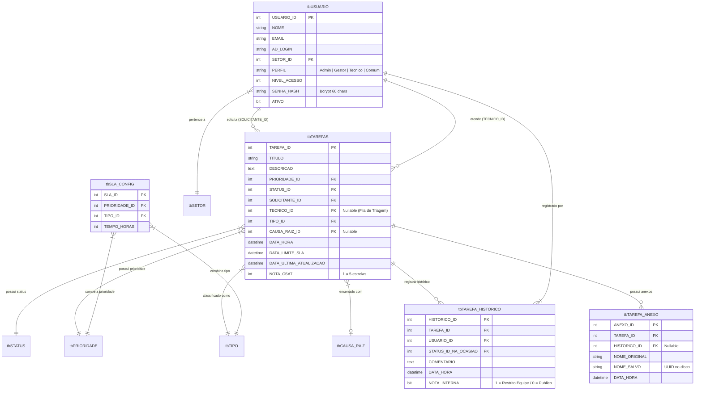

# 🎧 Saavedra Chamados — Sistema de Gestão de Chamados ITIL & Automação DevOps

[](https://www.python.org/)
[](https://fastapi.tiangolo.com/)
[](https://www.microsoft.com/sql-server)
[](LICENSE)
[]()

> **Saavedra Chamados** é uma plataforma corporativa completa para gestão de serviços de TI e Helpdesk alinhada às melhores práticas **ITIL v4**. O sistema engloba controle de SLA, cálculo de matriz de prioridades, pesquisa de satisfação (CSAT), dashboard interativo de BI e automação de rotinas de suporte técnico.

---

## 📌 Sumário

- [Visão Geral](#-visão-geral)
- [Funcionalidades Principais](#-funcionalidades-principais)
- [Arquitetura do Banco de Dados](#-arquitetura-do-banco-de-dados)
- [Arquitetura e Tecnologias](#-arquitetura-e-tecnologias)
- [Estrutura do Repositório](#-estrutura-do-repositório)
- [Pré-requisitos e Instalação](#-pré-requisitos-e-instalação)
- [Configuração de Variáveis de Ambiente (`.env`)](#-configuração-de-variáveis-de-ambiente-env)
- [Endpoints da API REST](#-endpoints-da-api-rest)
- [Automações & Cron Jobs ITIL](#-automações--cron-jobs-itil)
- [Plano de Estudos & Automação DevOps (30 Dias)](#-plano-de-estudos--automação-devops-30-dias)
- [Desenvolvedor & Autoria](#-desenvolvedor--autoria)
- [Licença](#-licença)

---

## 🌐 Visão Geral

O **Saavedra Chamados** foi desenvolvido para centralizar, organizar e automatizar as operações de suporte de TI. Oferece interfaces distintas e adaptativas conforme o perfil do usuário (**Administrador, Gestor, Técnico e Solicitante/Comum**), garantindo segurança, controle rigoroso de prazos e métricas analíticas em tempo real.

```text
┌─────────────────┐       ┌─────────────────┐       ┌────────────────────────┐
│  Frontend Web   │ ◄───► │  Backend REST   │ ◄───► │ Banco SQL Server (DB)  │
│ HTML5/CSS3/JS   │ HTTP  │ FastAPI/Uvicorn │ PyODBC│  - tbTAREFAS           │
└─────────────────┘       └─────────────────┘       │  - tbUSUARIO           │
                                   │                │  - tbSLA_CONFIG        │
                                   ▼                └────────────────────────┘
                            ┌───────────────┐
                            │ Servidor SMTP │
                            │ (Notificações)│
                            └───────────────┘
```

---

## ✨ Funcionalidades Principais

### 🎫 Gestão do Ciclo de Vida do Chamado (ITIL)
- **Abertura e Triagem:** Formulário intuitivo de abertura com suporte a múltiplos anexos e recurso **Copy & Paste** dinâmico (com visualização de miniaturas).
- **Editor Rico (WYSIWYG):** Descrições e Work Notes contam com formatação avançada (Quill.js) para inserção estruturada de textos, listas e blocos de código.
- **Atribuição & Fila:** Triagem automatizada com opção de atribuição direta a técnicos ou permanência na fila geral.
- **Histórico & Notas Internas:** Linha do tempo detalhada das movimentações do ticket, permitindo comentários públicos ou **notas internas restritas** à equipe técnica.
- **Fechamento Obrigatório:** Validação de **Causa Raiz** para encerramento ou cancelamento de tickets.

### ⏱️ Gestão Inteligente de SLA (Service Level Agreement)
- Matriz dinâmica de tempo de atendimento baseada em **Prioridade x Tipo de Incidente/Solicitação**.
- Indicadores visuais de status do SLA: **Normal**, **Em Atenção (prazo crítico < 2h)** e **Estourado (Vencido)**.
- Re-cálculo de prazos conforme alterações de classificação pelo técnico.

### ⭐ Pesquisa de Satisfação (CSAT - Customer Satisfaction)
- Avaliação de atendimento pós-encerramento (escala de 1 a 5 estrelas).
- Envio automático de e-mail interativo contendo links diretos para avaliação com 1 clique.
- Script de **reenvio em massa** de pesquisas pendentes para aumentar o engajamento dos usuários.

### 📊 Painel BI & Relatórios Gerenciais
- Dashboard analítico interativo com **suporte a cross-filtering** e filtros por período, setor, tipo e técnico.
- Indicadores de Volume de Chamados por Setor, Ranking de Solicitantes, Distribuição de Causas Raiz e Nota Média de CSAT.
- Exportação de relatórios para **Excel / CSV**.

### 🔐 Segurança & Auditoria Avançada
- **Autenticação de Sessão:** Controle via cookie de sessão encriptado (`SessionMiddleware`).
- **Criptografia de Senhas:** Armazenamento seguro de senhas com algoritmo **Bcrypt** puro.
- **Sistema de Auditoria & Logs:** Log rotativo de requisições HTTP, exceções e auditoria de ações críticas armazenado em `logs/sistema_geral.log` com limpeza automática a cada 7 dias.

---

## 🗄️ Arquitetura do Banco de Dados

O banco de dados relacional **Microsoft SQL Server** foi modelado sob princípios de integridade referencial, suportando alta volumetria de tickets e rastreabilidade total de histórico.

### Diagrama Entidade-Relacionamento (ER)



### 📋 Descrição das Principais Tabelas

1. **`tbTAREFAS`**: Tabela central contendo os tickets de suporte. Registra datas de abertura, limites calculados de SLA, nota CSAT atribuída pelo usuário e chaves para o solicitante e técnico responsável.
2. **`tbUSUARIO`**: Gerencia usuários, credenciais hash Bcrypt, vínculo com setor e níveis de permissão (`Admin`, `Gestor`, `Tecnico`, `Comum`).
3. **`tbTAREFA_HISTORICO`**: Armazena a linha do tempo completa do chamado. Contém a flag `NOTA_INTERNA` para separar apontamentos privados entre técnicos das respostas públicas para os solicitantes.
4. **`tbTAREFA_ANEXO`**: Registra ficheiros anexados no momento da abertura ou no decorrer dos atendimentos, armazenados em disco com nome seguro UUID em `uploads/`.
5. **`tbSLA_CONFIG`**: Matriz de configuração onde o Administrador estabelece o tempo em horas limite para cada combinação de Prioridade (ex: Crítica, Alta, Média) e Tipo (ex: Incidente, Solicitação).
6. **Tabelas Auxiliares de Domínio (`tbSTATUS`, `tbPRIORIDADE`, `tbTIPO`, `tbCAUSA_RAIZ`, `tbSETOR`)**: Mantêm os cadastros dinâmicos e inativáveis que alimentam os selects e dashboards da aplicação.

---

## 🛠️ Arquitetura e Tecnologias

### **Backend**
- **Linguagem:** Python 3.10+
- **Framework Web:** [FastAPI](https://fastapi.tiangolo.com/) com servidor ASGI [Uvicorn](https://www.uvicorn.org/) (Arquitetura modular baseada em `APIRouter`)
- **OR/Query Layer:** [SQLAlchemy](https://www.sqlalchemy.org/) com driver [PyODBC](https://github.com/mkleehammer/pyodbc)
- **Segurança:** `bcrypt` para hash de credenciais e `Starlette SessionMiddleware`
- **Validação de Dados:** `Pydantic v2`

### **Frontend**
- **Core:** Vanilla JavaScript (ES6+), HTML5 Semântico
- **Estilização:** CSS3 puro com Design System proprietário (variáveis CSS, layouts flex/grid e suporte a modo responsivo)
- **Design & Ícones:** [Google Material Symbols](https://fonts.google.com/icons)

### **Banco de Dados**
- **Engine:** Microsoft SQL Server (2016+)

---

## 📂 Estrutura do Repositório

```text
.
├── api/                      # Backend em Python FastAPI
│   ├── main.py               # Ponto de entrada (Uvicorn), middlewares e scheduler ITIL
│   ├── utils.py              # Funções utilitárias centralizadas (e-mail, data, logs)
│   ├── routers/              # Controladores isolados por domínio (Modularização APIRouter)
│   │   ├── admin.py          # Lógica administrativa (SLAs e configurações)
│   │   ├── auth.py           # Autenticação e gestão de sessão
│   │   ├── cadastros.py      # CRUD de usuários e domínios básicos
│   │   ├── relatorios.py     # KPIs e métricas do BI
│   │   └── tarefas.py        # Fila principal de chamados e ações
│   ├── migrasenha.py         # Script utilitário para migração segura de senhas em lote para Bcrypt
│   ├── reenviar_csat.py      # Disparador automatizado de lembretes de pesquisa de satisfação
│   └── testar_email.py       # Script utilitário para validação de conexões SMTP
├── frontend/                 # Frontend Web
│   ├── js/                   # Scripts isolados
│   │   └── anexos.js         # Módulo avançado de anexos e manipulação de DataTransfer (Copy & Paste)
│   ├── auth.js               # Gestor global de autenticação, sessão e níveis de permissão DOM
│   ├── style.css             # Design System moderno, variáveis de temas e componentes
│   ├── index.html            # Dashboard principal e Fila de Chamados
│   ├── admin.html            # Painel Administrativo (Usuários, SLAs e Tabelas Auxiliares)
│   ├── bi.html               # Painel de Business Intelligence / Analytics
│   ├── detalhe_chamado.html  # Visualização de ticket, inclusão de anexos e histórico
│   ├── login.html            # Tela de autenticação corporativa
│   ├── novo_chamado.html     # Formulário de abertura de chamados com WYSIWYG
│   ├── relatorios.html       # Painel de Relatórios Gerenciais (Admin/Gestor)
│   └── relatorios_comum.html # Painel de Acompanhamento Pessoal (Solicitante)
├── anotacoes/                # Registros semanais de aprendizado e laboratórios
│   └── semana-01.md          # Template e anotações do plano de estudos
├── cronograma.md             # Roteiro detalhado semana a semana (Plano 30 Dias DevOps)
├── recursos.md               # Guia de links, documentações e ferramentas de referência
├── LICENSE                   # Licença de uso do software
└── README.md                 # Visão geral do projeto (este arquivo)
```

---

## 🚀 Pré-requisitos e Instalação

### **1. Requisitos do Sistema**
- **Python 3.10** ou superior instalado.
- **Microsoft SQL Server** configurado e acessível.
- **Driver ODBC para SQL Server** (*Microsoft ODBC Driver 17 or 18 for SQL Server*).

### **2. Configuração do Backend**

Clone o repositório e navegue até a pasta da API:
```bash
git clone https://github.com/suportesaav-web/saavedra_chamados.git
cd saavedra_chamados/api
```

Crie e ative um ambiente virtual Python:
```bash
# Windows (PowerShell)
python -m venv venv
.\venv\Scripts\activate

# Linux/macOS
python3 -m venv venv
source venv/bin/activate
```

Instale as dependências exigidas:
```bash
pip install fastapi uvicorn sqlalchemy pyodbc bcrypt python-dotenv pydantic
```

---

## 🔑 Configuração de Variáveis de Ambiente (`.env`)

Crie um arquivo `.env` dentro do diretório `api/` com a seguinte estrutura de exemplo:

```ini
# Configurações do Banco de Dados SQL Server
SAAVEDRA_DB_USER=chamados
SAAVEDRA_DB_PASS=SuaSenhaSegura123
SAAVEDRA_DB_HOST=10.0.0.252
SAAVEDRA_DB_NAME=GestaoChamados

# Chave de Criptografia da Sessão Web
SAAVEDRA_SECRET_KEY=sua_chave_secreta_super_segura_aqui!

# Configurações de E-mail (SMTP)
SAAVEDRA_SMTP_HOST=smtp.office365.com
SAAVEDRA_SMTP_PORT=587
SAAVEDRA_SMTP_USER=suporte.saav@saavedra.com.br
SAAVEDRA_SMTP_PASS=SuaSenhaSMTP
SAAVEDRA_SMTP_FROM=suporte.saav@saavedra.com.br
```

---

## 🏃 Executando a Aplicação

### **Iniciando a API Backend**
Dentro do diretório `api/` (com o ambiente virtual ativo):
```bash
uvicorn main:app --host 0.0.0.0 --port 8000 --reload
```

A documentação interativa Swagger da API estará disponível em:
👉 **`http://localhost:8000/docs`**

### **Acessando o Frontend**
Abra o arquivo `frontend/index.html` em seu navegador ou utilize um servidor web estático (ex: extensão *Live Server* no VS Code ou Nginx/IIS).

---

## 🔌 Endpoints da API REST

| Método | Rota | Descrição | Acesso |
| :--- | :--- | :--- | :--- |
| `POST` | `/api/auth/login` | Realiza autenticação e inicia sessão web | Público |
| `GET` | `/api/auth/me` | Retorna dados do usuário autenticado | Autenticado |
| `GET` | `/api/auth/logout` | Encerra a sessão ativa do usuário | Autenticado |
| `POST` | `/api/auth/alterar-senha` | Altera a senha do usuário logado | Autenticado |
| `GET` | `/api/kpis` | Retorna métricas e contadores dinâmicos de SLA/Status | Autenticado |
| `GET` | `/api/tarefas` | Lista chamados da fila com filtros e paginação | Admin/Gestor/Técnico |
| `GET` | `/api/meus-chamados` | Lista os chamados abertos pelo solicitante logado | Solicitante |
| `GET` | `/api/tarefas/{id}` | Retorna detalhes completos e anexos do chamado | Autenticado |
| `POST` | `/api/tarefas` | Registra um novo chamado na plataforma | Autenticado |
| `PUT` | `/api/tarefas/{id}` | Atualiza status, técnico, tipo ou causa raiz do chamado | Admin/Gestor/Técnico |
| `POST` | `/api/tarefas/{id}/responder` | Adiciona comentário/resposta ao histórico do chamado | Autenticado |
| `POST` | `/api/tarefas/{id}/anexar` | Envia e vincula ficheiros/anexos ao chamado | Autenticado |
| `POST` | `/api/tarefas/{id}/avaliar` | Registra nota CSAT (1 a 5 estrelas) no chamado | Solicitante |
| `GET` | `/api/usuarios` | Lista todos os usuários cadastrados | Admin/Gestor |
| `GET` | `/api/admin/sla-matrix` | Retorna a matriz configurável de SLAs | Admin |
| `POST` | `/api/admin/reenviar-csat-pendentes` | Dispara e-mails de lembrete CSAT pendentes em lote | Admin |

---

## 🤖 Automações & Cron Jobs ITIL

O backend conta com rotinas automáticas de background:

1. **Encerramento Automático por Inatividade:**
   Chamados que estejam com status de *Aguardando Solicitante* ou *Validação* há mais de **3 dias** sem atualização são automaticamente encerrados pela rotina ITIL, atribuindo a causa raiz `"Encerramento Automático (Inatividade ITIL)"` e registrando o histórico de sistema.

2. **Limpeza de Logs de Auditoria:**
   Logs de auditoria gerados em `logs/sistema_geral.log` com mais de 7 dias de criação são expurgados rotineiramente para preservação de espaço em disco.

---

## 📚 Plano de Estudos & Automação DevOps (30 Dias)

Além da aplicação de chamados, este repositório serve como base prática do **Plano de Estudos em Automação e DevOps**:

- **[`cronograma.md`](file:///m:/GestaoChamados/cronograma.md):** Roteiro diário dividido em 4 semanas cobrindo Python básico, Git, SQL, consumo de APIs HTTP, criação de serviços REST com FastAPI e rotinas de automação.
- **[`recursos.md`](file:///m:/GestaoChamados/recursos.md):** Links e documentações de referência recomendadas.
- **[`anotacoes/`](file:///m:/GestaoChamados/anotacoes/):** Espaço dedicado para registro de aprendizados e relatórios de laboratórios.

---

## 👨‍💻 Desenvolvedor & Autoria

Projetado e desenvolvido por **Jonatan Severo**.

- 📧 **E-mail:** [suporte.saav@saavedra.com.br](mailto:suporte.saav@saavedra.com.br)
- 💼 **LinkedIn:** [linkedin.com/in/jonatanfsevero](https://www.linkedin.com/in/jonatanfsevero/)
- 🏢 **Organização:** Saavedra Suporte Web

---

## 📄 Licença

Este projeto está licenciado sob os termos da licença **MIT**. Para mais detalhes, consulte o arquivo [`LICENSE`](file:///m:/GestaoChamados/LICENSE).

---

<p align="center">
  Desenvolvido com 🧡 por <strong>Jonatan Severo</strong> — Saavedra Suporte Web
</p>
