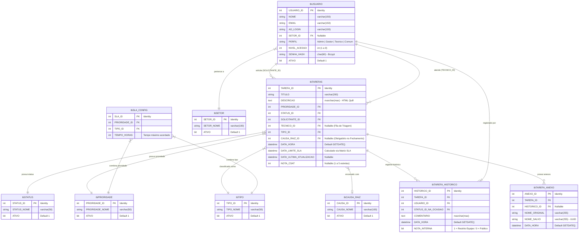

# 🗄️ Modelagem e Arquitetura do Banco de Dados

Este documento descreve detalhadamente a estrutura de dados relacional do **Saavedra Chamados**, implementada em **Microsoft SQL Server 2016 Standard Edition**.

---

## 📌 Visão Geral

O banco de dados relacional `GestaoChamados` foi modelado sob princípios de integridade referencial, com suporte a alta concorrência, controle transacional rigoroso de chamados e rastreabilidade completa de histórico e auditoria.

---

## 📊 Diagrama Entidade-Relacionamento (ER)

---

## 📋 Dicionário de Dados

### 1. `tbTAREFAS` (Tabela Central de Chamados)
Registra todas as requisições de serviço e incidentes de TI abertos na plataforma.

| Campo | Tipo | Nulo? | Descrição |
| :--- | :--- | :--- | :--- |
| `TAREFA_ID` | `INT` (PK) | Não | Identificador único incremental do ticket. |
| `TITULO` | `VARCHAR(200)` | Não | Resumo breve do chamado. |
| `DESCRICAO` | `NVARCHAR(MAX)` | Não | Conteúdo rico formatado (HTML via editor Quill). |
| `PRIORIDADE_ID` | `INT` (FK) | Não | Nível de urgência/impacto (1 = Crítico, etc.). |
| `STATUS_ID` | `INT` (FK) | Não | Estado atual do chamado no ciclo de vida. |
| `SOLICITANTE_ID`| `INT` (FK) | Não | Usuário corporativo que originou o chamado. |
| `TECNICO_ID` | `INT` (FK) | Sim | Técnico responsável pelo atendimento (`NULL` indica Fila Geral). |
| `TIPO_ID` | `INT` (FK) | Não | Classificação da demanda (Incidente, Requisição, Dúvida, etc.). |
| `CAUSA_RAIZ_ID` | `INT` (FK) | Sim | Causa identificada no encerramento (Obrigatória para status 4 e 6). |
| `DATA_HORA` | `DATETIME` | Não | Timestamp de criação do chamado (`GETDATE()`). |
| `DATA_LIMITE_SLA`| `DATETIME` | Não | Prazo máximo estipulado dinamicamente pela Matriz de SLA. |
| `DATA_ULTIMA_ATUALIZACAO` | `DATETIME` | Sim | Timestamp da última movimentação técnica ou resposta do solicitante. |
| `NOTA_CSAT` | `INT` | Sim | Nota de satisfação atribuída pelo solicitante (escala de 1 a 5). |

### 2. `tbUSUARIO` (Controle de Acessos e Perfis)
Centraliza os usuários da organização, perfis e credenciais de acesso.

| Campo | Tipo | Nulo? | Descrição |
| :--- | :--- | :--- | :--- |
| `USUARIO_ID` | `INT` (PK) | Não | ID único do usuário. |
| `NOME` | `VARCHAR(150)` | Não | Nome completo do colaborador. |
| `EMAIL` | `VARCHAR(150)` | Não | E-mail corporativo (usado no login e notificações). |
| `AD_LOGIN` | `VARCHAR(100)` | Sim | Nome de login no Active Directory corporativo. |
| `SETOR_ID` | `INT` (FK) | Sim | Departamento/setor do usuário. |
| `PERFIL` | `VARCHAR(30)` | Não | Perfil funcional: `Admin`, `Gestor`, `Tecnico` ou `Comum`. |
| `NIVEL_ACESSO` | `INT` | Não | Nível numérico de autorização no sistema. |
| `SENHA_HASH` | `VARCHAR(60)` | Não | Hash criptográfico gerado com Bcrypt nativo. |
| `ATIVO` | `BIT` | Não | Status de ativação da conta (`1` = Ativo, `0` = Inativo). |

### 3. `tbTAREFA_HISTORICO` (Linha do Tempo / Work Notes)
Registra cada movimentação, troca de status, parecer do técnico ou resposta do solicitante.

| Campo | Tipo | Nulo? | Descrição |
| :--- | :--- | :--- | :--- |
| `HISTORICO_ID` | `INT` (PK) | Não | ID incremental da entrada de histórico. |
| `TAREFA_ID` | `INT` (FK) | Não | Vínculo com a tarefa correspondente. |
| `USUARIO_ID` | `INT` (FK) | Não | Autor da nota ou da ação. |
| `STATUS_ID_NA_OCASIAO` | `INT` (FK) | Não | Status em que o ticket ficou após a movimentação. |
| `COMENTARIO` | `NVARCHAR(MAX)` | Não | Mensagem ou nota técnica descritiva. |
| `DATA_HORA` | `DATETIME` | Não | Timestamp exato da movimentação. |
| `NOTA_INTERNA` | `BIT` | Não | Flag de sigilo: `1` visível apenas para técnicos/admin, `0` visível a todos. |

### 4. `tbTAREFA_ANEXO` (Gestão de Documentos e Evidências)
Gerencia referências aos arquivos anexados aos tickets e históricos.

| Campo | Tipo | Nulo? | Descrição |
| :--- | :--- | :--- | :--- |
| `ANEXO_ID` | `INT` (PK) | Não | ID único do anexo. |
| `TAREFA_ID` | `INT` (FK) | Não | Vínculo com o chamado principal. |
| `HISTORICO_ID`| `INT` (FK) | Sim | Vínculo opcional com um comentário específico do histórico. |
| `NOME_ORIGINAL`| `VARCHAR(255)`| Não | Nome original do arquivo no computador do usuário. |
| `NOME_SALVO` | `VARCHAR(255)`| Não | Nome único gerado em disco (`UUID.ext`) para prevenção de colisão e segurança. |
| `DATA_HORA` | `DATETIME` | Não | Timestamp do upload. |

### 5. `tbSLA_CONFIG` (Matriz Dinâmica de SLA)
Define o tempo limite acordado (em horas) com base na combinação de Prioridade e Tipo.

| Campo | Tipo | Nulo? | Descrição |
| :--- | :--- | :--- | :--- |
| `SLA_ID` | `INT` (PK) | Não | Identificador da regra. |
| `PRIORIDADE_ID`| `INT` (FK) | Não | Chave da prioridade. |
| `TIPO_ID` | `INT` (FK) | Não | Chave da categoria de chamado. |
| `TEMPO_HORAS` | `INT` | Não | Horas corridas acordadas para a resolução. |

---

## ⚙️ Tabelas Auxiliares de Domínio

- **`tbSTATUS`**: Estados possíveis do chamado (`Novo`, `Em Atendimento`, `Aguardando Solicitante`, `Resolvido`, `Cancelado`, etc.).
- **`tbPRIORIDADE`**: Níveis de severidade acordados (`Sem Prioridade`, `Baixa`, `Média`, `Alta`, `Crítica`).
- **`tbTIPO`**: Categorização do ticket (`Incidente`, `Requisição`, `Dúvida`, `Acesso`, `Hardware`, `Software`).
- **`tbCAUSA_RAIZ`**: Motivos de encerramento (`Falha Operacional`, `Defeito em Equipamento`, `Inatividade ITIL`, etc.).
- **`tbSETOR`**: Departamentos corporativos (`Financeiro`, `Comercial`, `Operações`, `RH`, `TI`, etc.).
